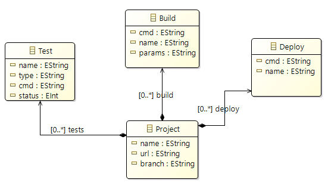

# Mdeploy

This is an Eclipse Modeling Framework (EMF) project designed to streamline model-driven development by supporting Transformation-to-Model (T2M), Model-to-Model (M2M), and Model-to-Text (M2T) transformations before deploying the processed data to the backend for the web API.

## Project structure

```
Mdeploy
├── model
│   ├── initConfig
│   │   └── InitConfig.ecore
│   │   └── InitConfig.genmodel
│   │   └── InitConfig.aird
│   ├── gitlab
│   └── terraform
└── src
    ├── initConfig
    │   └── impl
    │   └── util
    │   └── ...
    ├── gitlab
    ├── terraform
    ├── projectIn
    │   └── JsonToModel.java
    │   └── project.json
    │   └── project.xmi
    ├── m2mTransformation
    │   └── InitConfigToGitlabTransformer.java
    │   └── InitConfigToGitlabEpsilon.etl
    │   └── gitlab.model
    ├── projectOut
    │   └── GitlabToYaml.java
    │   └── GitlabToYamlEpsilon.egl
    │   └── gitlab-ci.yml
    ├── terraformIn
    └── terraformOut
```

## Table of content

- [Requirements](#requirements)
- [Model](#model)
  - [Ecore metamodels](#ecore-metamodels)
  - [Generator models](#generator-models)
  - [Representation diagrams](#representation-diagrams)
- [Src folder](#src-folder)
  - [projectIn](#projectin)
  - [m2mTransformation](#m2mtransformation)
  - [projectOut](#projectout)

## Requirements

The following JAR libraries are included in the project classpath:

- Jackson Annotations (v2.18.2) [Maven](https://mvnrepository.com/artifact/com.fasterxml.jackson.core/jackson-annotations/2.18.2)
- Jackson Core (v2.18.2) [Maven](https://mvnrepository.com/artifact/com.fasterxml.jackson.core/jackson-core/2.18.2)
- Jackson Databind (v2.18.2) [Maven](https://mvnrepository.com/artifact/com.fasterxml.jackson.core/jackson-databind/2.18.2)
- EMF XML/XMI Persistence (v2.38) [Maven](https://mvnrepository.com/artifact/org.eclipse.emf/org.eclipse.emf.ecore.xmi/2.38.0) 
- SnakeYAML (v2.3) [Maven](https://mvnrepository.com/artifact/org.yaml/snakeyaml/2.3)

## Model

This folder contains primarily the `.ecore` files, which represent the metamodels, `.genmodel` which contain generation configurations and `.aird` for graphical diagrams of the metamodels. 

For insight into how we can create and implement these files, checkout [MDE labs](https://github.com/Cristal32/MDE_labs) containing labs for beginners in MDE.

### Ecore metamodels

A **metamodel** (`.ecore`)is an abstract representation that defines the structure, semantics, and constraints of models within a specific domain. It serves as the "model of models," establishing the rules and elements that models in your project must adhere to.

<p align="center">
    
</p>

### Generator models

A **Generator Model (GenModel)** is a configuration model (`.genmodel`) to control the code generation process for EMF-based projects. It extends the metamodel (Ecore) by adding information about how to generate Java code for the defined Ecore model.

<p align="center">
    
</p>

It is later used to generate Java classes that represent metamodels (like `src/InitConfig`), which can be used as model files in our Springboot API.

To generate those files, we can simply right-click the source package of the genmodel and select 'Generate Model Code'. The generated code is automatically added in the src folder.

### Representation diagrams

An **AIRD file (Acceleo Integrated Representation Diagram)** is an Eclipse Sirius resource (`.aird`) that stores graphical representations of models. It acts as a container for diagrams, tables, and other representations that visually depict the elements and relationships defined in a model.

In simpler terms, it can help us depict a graphical representation of our metamodels.

<p align="center">
    
</p>

## Src folder

This  folder contains the rest of our project's files (scripts and generated model files)

### projectIn

This folder contains the script file that implements a T2M transformation. It converts from a JSON files to an initConfig model. (A model is the instance of a metamodel):

- `JsonToModel.java` parses JSON data and maps it to an initConfig model of `.xmi` format (which one of the functioning model formats).

To test it out, simply compile and execute the Java file.

### m2mTransformation

In this folder, there are 2 script files that implement M2M transformation:

- `InitConfigToGitlabTransformer.java`: 

Maps from an initConfig model to a gitlab model. (note that `.model` and `.xmi` are both model files that can be used similarly, at least in the context of this project). To test it out, execute th Java file.

- `InitConfigToGitlabEpsilon.etl`: 

A second approach to this transformation is to implement Epsilon ETL rules. The Epsilon Transformation Language (ETL) is part of the Epsilon platform. It is a rule-based language specifically designed for model-to-model (M2M) transformations. 

In order to test it out: 
1. Run Configurations
2. In the search bar on the left, look for ETL Transformation and double-click it; It will create a configuration `InitConfigToGitlabEpsilon`, click on it.
3. Go to the Models tab, use the Add button to add the source (InitConfig) and target (Gitlab) models and their metamodels. For example, to add the InitConfig model (project.xmi):

<p align="center">
    
</p>

The source and target model files should exist before running the configuration (even the target file should exist, even if still empty).

The end result should be this:

<p align="center">
    
</p>

4. Apply and Run

The result is written on the target model file (In this example, `gitlab.xmi`).

### projectOut

Finally, in here we implemented the M2T logic. 

- `GitlabToYaml.java`:

Maps from the gitlab.xmi model into a YAML file `gitlab-ci.yml`, using the SnakeYAML library.

- `GitlabToYamlEpsilon.egl`:

The **Epsilon Generation Language (EGL)** is a text generation language that is part of the Epsilon platform. It is used for Model-to-Text (M2T) transformations, enabling the automated generation of textual artifacts (like code, configuration files, documentation) from models.

EGL is particularly suited for scenarios where the output needs to be highly customizable and formatted, such as generating source code, deployment scripts, or configuration files.

Thanks to its huge flexibility, it allows us to create templates and insert metamodel data into them directly. It also can be tested by running an EGL configuration. Similarly to ETL, simply choose EGL Transformation in the search bar and selecting gitlab in the Models tab.

<p align="center">
    
</p>